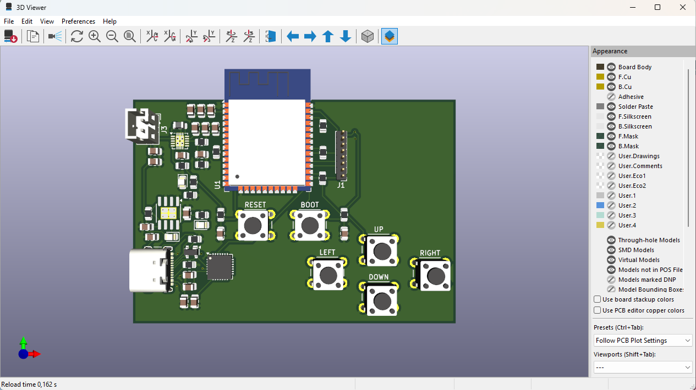
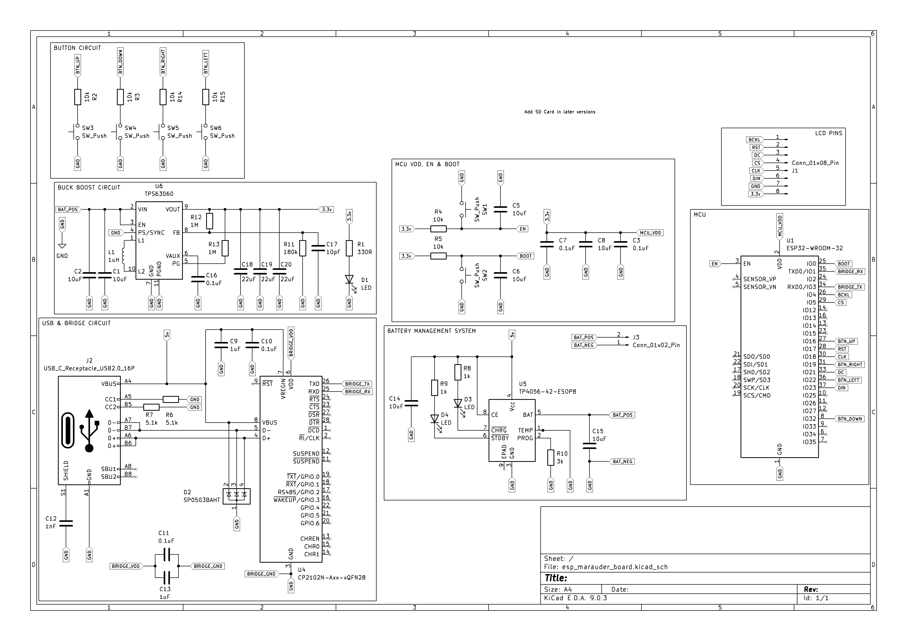

<h1 align="center"> BLEFI Device</h1>

  ESP32-based wireless exploration platform for WiFi & BLE systems

---

## Overview

**BLEFI Device** is an embedded systems project built using the ESP32 and ESP-IDF.

It focuses on wireless experimentation, starting with WiFi packet sniffing and slowly expanding to include additional WiFi functionality, BLE communication, low-power operation, and practical IoT use cases.

---

## Current Features

- WiFi packet sniffing (promiscuous mode)
- Basic directory-style menu system
- Event-driven Button input system

---

## Current Hardware

- ESP32-WROOM-32 Dev Board
- Button-based input system

---

## Hardware Design

### PCB Layout

  

Custom PCB designed in KiCad integrating ESP32, power management, USB interface, and user input system. **Work still in progress**

### Schematic

  

This system schematic shows the power architecture, USB interface, MCU connections, and peripheral subsystems.

---

## Firmware Demo

### Current Setup

  

### Sniffing my own network

  

Information shown on screen includes the SSID, network signal strength (RSSI), MAC addresses and the current channel of the packet found.

---

## Planned Features

- Expand WiFi functionality (promiscuous mode)
- BLE functionality
- SD card logging
- Low-power / sleep modes
- Improve UI navigation

---

## Motivation

This project was built to deepen my understanding of low-level wireless communication on embedded systems, particularly working directly with ESP-IDF and real-time packet data.

It also serves as a foundation for future embedded projects involving IoT devices, data logging, and custom hardware design.

---
